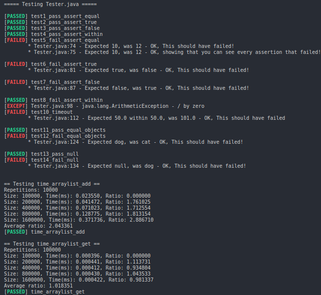

# student-java-tester

## Note

This library is still a work in progress. Some methods may be incomplete, poorly implemented, or wrong. Take this into consideration if you observe unexpected behavior.
## Purpose

Students often face restrictions on Java programming assignments that would make the use of unit testing software such as JUnit impractical. This library offers a single standalone file that can be transferred into the assignment test file without interfering with grading scripts. The goal is to reduce the time spent worrying about the formatting of test output, so that more time can be spent writing quality tests. API is based on the Unity syntax.

## Sample Output

## Key Features
  * **Modular** - 
  Individual tests can be grouped into separate methods

  * **Exception Handling** - 
  Testing will continue if a test throws an exception

  * **Algorithmic Comlexity Benchmarks (Prototype)** - 
  Multithreaded solution allows for faster big O benchmarking

  * **Colors** - 
  Colorful output to easily spot failures (tested on Unix only)

  * **Failure Descriptions** - 
  As with Unity, appending MESSAGE to any assertion call will allow for the addition of a
  helpful description of what failed

## TODO List

  * Big O benchmarking needs a more efficient distribution of threaded workload
  * Big O benchmarking needs continued verification of validity. The results seem erradic
